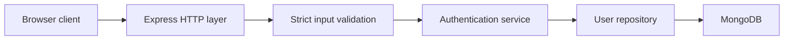
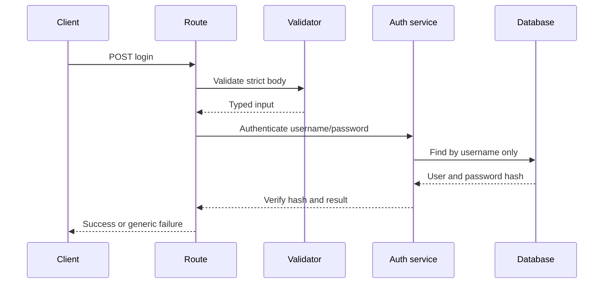

# Application Architecture

## 1. Architectural style

Use a small modular monolith. The application is simple enough to run as one Node.js process, but its modules should have clear boundaries so the data flow remains easy to explain and test.

The proposed layers are:

1. **Presentation layer:** static browser page and JSON HTTP responses.
2. **HTTP layer:** routes, request parsing, response status and error mapping.
3. **Validation layer:** strict schemas for body, headers and parameters.
4. **Application layer:** authentication use cases and business decisions.
5. **Repository layer:** explicit database operations.
6. **Infrastructure layer:** MongoDB connection, logging, configuration and server startup.

## 2. High-level topology



The secure route must pass through validation and an application-level password verification step. It must not let the browser define a database predicate.

## 3. Planned source tree

```text
src/
├── server.js
├── app.js
├── config/
│   ├── env.js
│   └── logger.js
├── db/
│   ├── client.js
│   ├── collections.js
│   └── indexes.js
├── middleware/
│   ├── error-handler.js
│   ├── not-found.js
│   ├── rate-limit.js
│   └── request-id.js
├── modules/
│   ├── auth/
│   │   ├── auth.routes.js
│   │   ├── auth.schemas.js
│   │   ├── auth.service.js
│   │   ├── auth.repository.js
│   │   └── auth.errors.js
│   └── health/
│       └── health.routes.js
├── shared/
│   ├── http-errors.js
│   ├── result.js
│   └── constants.js
└── public/
    ├── index.html
    ├── app.js
    └── styles.css
```

## 4. Module responsibilities

### `server.js`

- Load environment configuration.
- Connect to MongoDB.
- Create indexes.
- Start the HTTP server.
- Handle graceful shutdown.

### `app.js`

- Create the Express application.
- Register JSON parsing with a small body limit.
- Register security middleware.
- Mount routes.
- Register not-found and error handlers.

### `auth.routes.js`

- Translate HTTP requests into use-case calls.
- Never contain database query construction.
- Return stable response shapes and status codes.

### `auth.schemas.js`

- Require username and password to be strings.
- Reject unknown keys.
- Enforce length limits.
- Reject objects, arrays, null values and operators.

### `auth.service.js`

- Load a user by username.
- Verify the password hash.
- Decide success or failure.
- Avoid leaking whether a username exists.

### `auth.repository.js`

- Expose explicit functions such as `findUserByUsername`.
- Keep database filters authored by the application.
- Never accept a complete query object from the browser.

## 5. Request flows

### Secure login



### Lab observation path

The lab path may intentionally show the unsafe query shape, but it must be isolated, clearly named and unavailable when the application runs in secure mode. It must use synthetic data and a local database only.

## 6. Runtime modes

- `secure`: default mode; exposes only corrected behavior.
- `lab`: explicitly enabled for local demonstration; exposes the isolated observation route.
- `test`: uses a separate database name and deterministic seed data.

The lab route should fail closed when `NODE_ENV=production` or when the host is not local.

## 7. Error handling

Use a consistent error shape:

```json
{
  "ok": false,
  "error": {
    "code": "INVALID_INPUT",
    "message": "Invalid request"
  },
  "requestId": "..."
}
```

Do not return stack traces, database error details or password-related information to the browser.

## 8. Deployment boundary

The supported deployment is local Docker Compose. No public reverse proxy, public DNS name or Internet-accessible MongoDB should be part of this project.