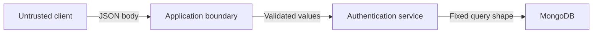

# Security Model

## 1. Security objective

The application must show how a query-shape flaw can affect an authentication decision and must then enforce a boundary where client data cannot become a database operator.

The demonstration is educational and local. It is not a production security certification and it must not target any external system.

## 2. Threat model

### Attacker capabilities

The untrusted client can:

- Send HTTP requests to the local login route.
- Change the JSON type of a field.
- Add unexpected fields.
- Repeat requests.
- Observe normal HTTP responses.

The untrusted client cannot be assumed to:

- Know the password.
- Access MongoDB directly.
- Read server environment variables.
- Modify server-side source code.

### Security assets

- User identity.
- Password hash.
- Authentication result.
- Session state.
- Database availability.

## 3. Trust boundaries



The most important boundary is between client-controlled input and application-controlled query construction.

## 4. Vulnerability mechanism

A vulnerable implementation treats `password` as if its type were guaranteed:

```javascript
const { username, password } = req.body;
const user = await collection.findOne({ username, password });
```

If `password` is an object, the object can be interpreted as a query predicate. This is not a malformed JSON problem. It is a security intent problem caused by missing type validation and unsafe query construction.

The secure design does not query by password. It queries by username and verifies the submitted password against the stored hash in application code.

## 5. Required controls

### Input controls

- Use a strict schema validator.
- Require scalar strings for username and password.
- Reject unknown fields.
- Reject arrays, objects, null and booleans where strings are expected.
- Enforce length and character limits.
- Apply a small JSON body limit.

### Query controls

- Build filters from explicit application fields.
- Never pass `req.body` or a client-supplied query object to MongoDB.
- Do not expose generic filtering in the authentication route.
- Reject nested operators in any user-controlled structure.

### Credential controls

- Store only password hashes in the secure collection.
- Use bcrypt or Argon2 with a suitable cost setting.
- Compare hashes in the application.
- Never log or return passwords or hashes.
- Use generic failure messages.

### Operational controls

- Run the lab route only in local mode.
- Use synthetic data.
- Use a least-privilege database account when credentials are configured.
- Add rate limiting.
- Add request IDs and safe security logs.
- Keep dependencies pinned and reviewed.

## 6. What not to claim

Do not claim that:

- One operator payload bypasses every MongoDB login.
- A login bypass automatically grants full database access.
- Password hashing alone fixes query injection.
- Parser or optimizer behavior is the root cause.
- A local lab result proves a production system is vulnerable.

The correct claim is narrower: under a documented local implementation, accepting an object where a scalar password was expected can change the query predicate and may affect the authentication result.

## 7. Security acceptance criteria

- The secure route rejects non-string credentials before database authentication.
- The secure repository has a fixed query shape.
- The secure collection has no plaintext password field.
- The lab route is not available in production mode.
- Responses do not reveal whether an arbitrary username exists.
- Logs contain enough evidence to debug without storing secrets.
- Tests cover operator objects, arrays, numbers, null and unknown keys.